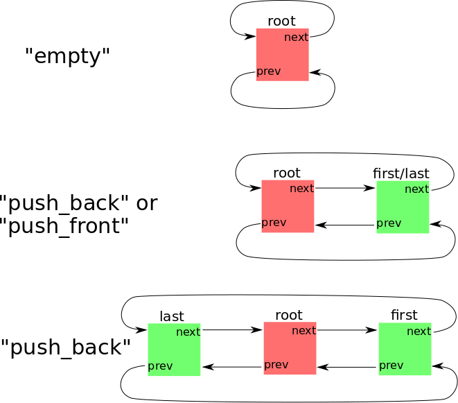

1 // item status
# Exercise EX3.1

This exercise is part **one** of three parts of EX3. See also [Item 000](https://cppitems.github.io/#/item/000) for an overview and deadlines. The submission deadline for EX3 (all three parts) is **Mo 10.01.2022, 4pm**. The sources related to EX3.1 are available at https://github.com/cppitems/ex3.1.

## Task description

In this exercise you have to implement an stdlib conformal, bidirectional iterator for the provided class template `List` in `include/List.hpp`. Let's first have a short introduction on some details.

### List details
The provided `List` is a fully functional doubly-linked list with a public `push_back` and `push_front` member function (but no further public member functions to insert or erase entries). All special member functions are either defaulted or user-defined. Further, the implementation relies on a *sentinel node* which is always present (even in a newly constructed empty `List` object). Let's have a quick look at parts of the implementation:
```cpp
template <typename T>
class List {    
  struct Node { 
    Node *prev = this;
    Node *next = this;
    T value;
  };
  // data members
  Node sentinel;
  Node *root = &sentinel;
  size_type size = 0; 
public: 
  List() = default; // default constructor
}
```
The implementation above implies that `T` is default constructible (due to the T member of sentinel node). This is in general **NOT** a desirable constraint on a template type (but this is not the focus of this exercise). Further note how the `prev` and `next` members of `Node` are defaulted: referencing the object itself. This already reveals the idea of the sentinel node: it serves as an entry to the list and is always connected to the first and last element (and if no elements are present, it is connected to itself):



## Task details and tests

To guide you through the requirement of towards the iterator you should implement several tests are provided:

- **TestA_dereference**: checks if an iterator obtained via `list.begin()` results in a reference to an entry stored in the list.
- **TestB_increment** and **TestC_decrement**: checks if the increment `++it` and decrement `--it` results again in an iterator providing access to the expected entry.
- **TestD_decrement_end**: checks if an iterator obtained via `list.end()` provides access the last entry in a list if it is deceremented once via `--it`.
- **TestE_member_access**: checks if *member-of-pointer* access is possible via the iterator, i.e. if `it->member` provides read and write access to the respective `member` of an entry in the list. 
- **TestF_comparisons**: checks if the comparison of iterators is enabled via `!=` and `==` operators
- **TestG_loops**: checks if the iterators work for
  - explicit for loops `for (auto it = list.begin(); it != list.end(); ++it)`
  - range-based for loops `for (const auto& item : list)`
  - while loops `while (it != list.end())`
- **TestH_const_access**: checks if iterators obtained from `List` objects providing `const` access only also provide only `const` access. Additionally `cbegin()` and `cend()` should also only provide const access. Further it is checked if the nested types for the respective iterators `List::iterator` and `List::const_iterator` are available.
- **TestI_stdlib_compatibility**: checks if the bidirectional iterator can be used in the context of functionality and algorithms from the stdlib and provides the expected nested types.

## Example

The project also includes a source file `src/fibonacci.cpp` which shows some usage of the `List` class. It is not built by default, but this can be done by using the cmake option to build it:

```bash
cmake -DBUILD_BENCHMARK=ON ..
```

## References
- Iterator member types needed for STL compatibility: https://en.cppreference.com/w/cpp/iterator/iterator_traits


